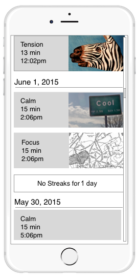

# streakfeed-ios

Project for Spire Streaks Feed Challenge

##Requirements
* User can vertically scroll (both upwards and downwards) to see all historical streaks with descending days
* For each streak, a "streak card" is rendered with the following data: streak type, duration and start time
* For streaks that have an associated photo, display the photo on the streak card
* For streaks that have an associated location, display a map frame of the location on the streak card
* For streaks that have both an associated location and photo, only display the photo on the streak card
* If there aren't streaks for a certain day, display a "No Streaks for Today" line item

##Mockup

##TODO for Production
* Unit Testing - I started building and writing code as I went along.
* Proper Code Documentation - Currently no documentation in code.
* Local Test Data - Currently pulling from REST server and using that as my sole data source.
* Error handling - Currently displaying a generic error message for all errors
* Data Persistence - Currently no data persistence, and no caching. App needs to always pull data from the server. 
* Switch between Production, Staging, and Development URLS
* Data Model Optimizations - Currently a lot of calculations to organize data after pulling from the server, which will be an issue for very large amounts of data. Should spend some time optimizing
* tableview optimizations - Used some open source to pull some data in background, but the tableview still slightly lags when scrolling, so there are some expensive calls are still occurring in the main thread. Will optimize later.

##Demo

